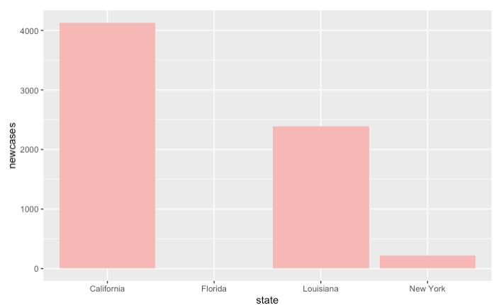
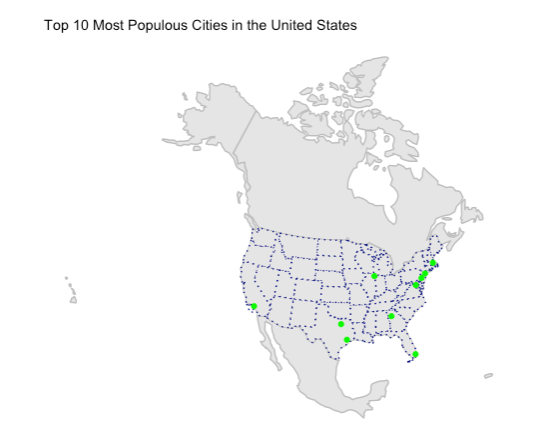
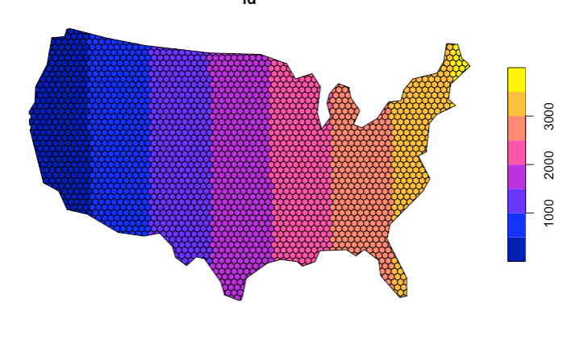

Here is a collection of projects from a six-week course I took on programming in the summer of 2021, which was also my first time using R!

## [Lab 1 - Building a project website](https://xochitlmedina.github.io/xochitlmedina/)

- In this assignment I created a GitHub user site
- I gained an understanding of Rmarkdown syntax
- I learned how to format a website

## [Lab 2: Data Wrangling - An Analysis of The Covid-19 Pandemic](https://xochitlmedina.github.io/geog-13-labs/geog-13-labs/docs/lab-o2.html)
 
 
  
  

- I gained a strong understanding of the functions of the dplyr package
- I made plots that suited the data at hand
- I found the 7-day rolling mean of data that represented daily events

## [Lab 3: Projections, Distancing, and Mapping - An Analysis of US Borders](https://xochitlmedina.github.io/geog-13-labs//lab-03.html)

 
 
 

- I gained a strong understanding of the functions of the SF package
- I changed the projections of spatial data within RStudio 
- I plotted spatial data using varying line weights, colors, and sizes

## [Lab 4: Tesselations, Spatial Joins, and Point-in-Polygon - An Analysis Dams and Tessellations](https://xochitlmedina.github.io/geog-13-labs//lab-04.html)

 
 

- I learned what a tessellation is
- I learned the difference between different tessellations and coverages
- I modified aforementioned tessellations

